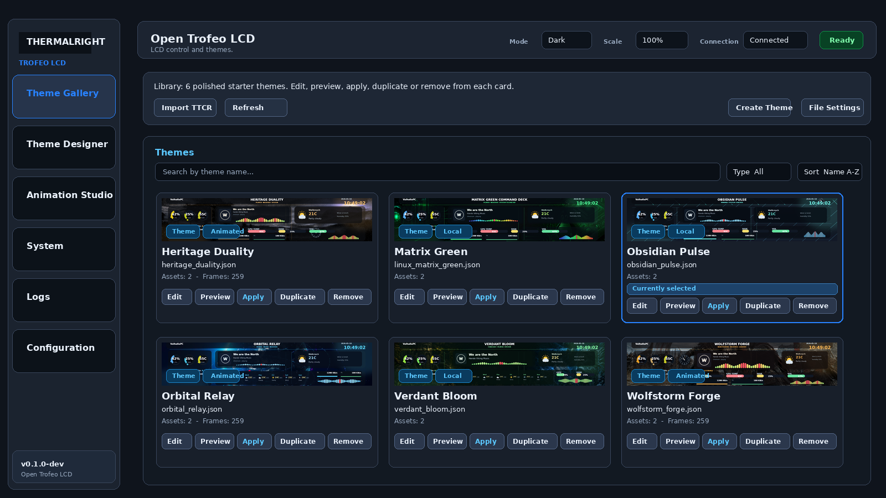
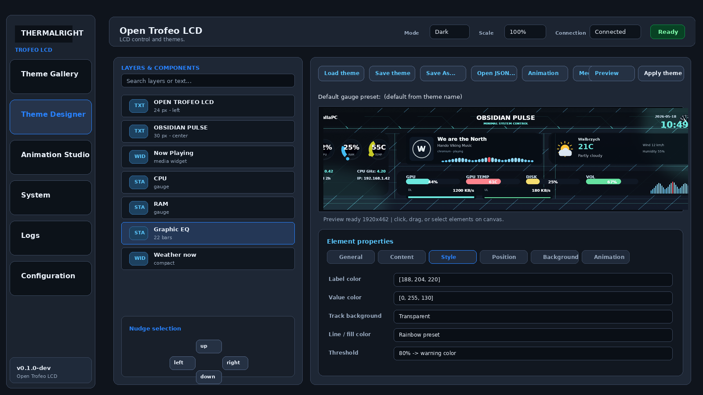
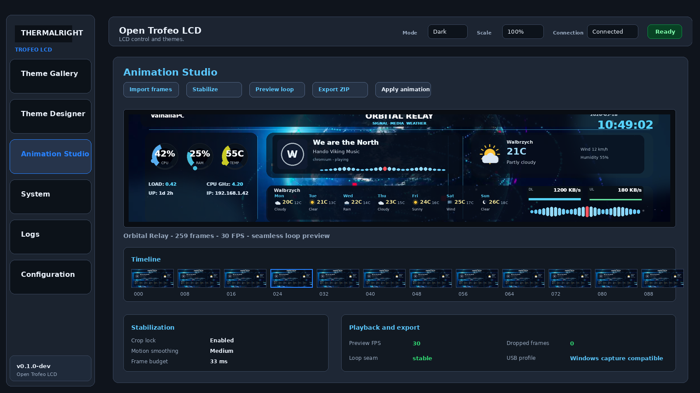
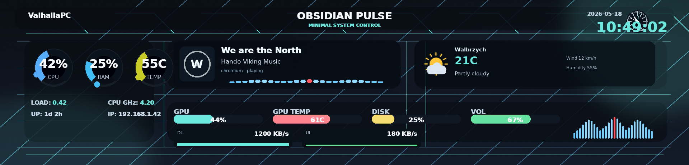
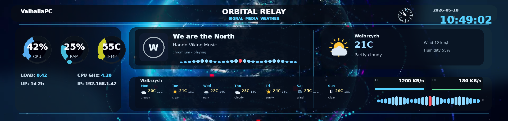
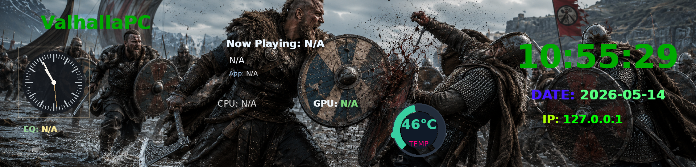
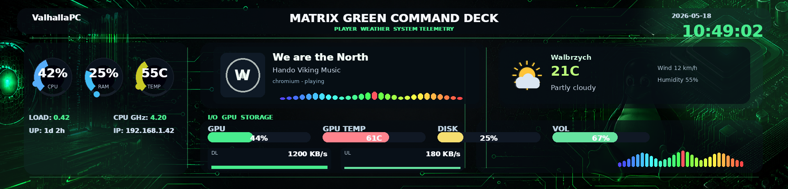

# Thermalright Trofeo LCD — Linux Open Driver

Reverse-engineered driver for the Thermalright Trofeo LCD cooler display.

> **Development preview**
>
> Open Trofeo LCD is usable, but it is still in active development. The USB
> driver, backend, theme gallery, Theme Designer, Animation Studio, MPRIS media
> widgets, gauges and packaging flow are being improved quickly. Expect UI
> changes, incomplete editor tools and occasional regressions while the project
> is prepared for broader Linux distribution.

## Project Status

Current focus:
- Stable local backend for the Thermalright Trofeo LCD USB display.
- Qt desktop GUI with Theme Gallery, Theme Designer and Animation Studio.
- Live system stats, MPRIS/Now Playing widgets, volume/EQ widgets, gauges and animated backgrounds.
- Safer single-backend runtime to avoid USB `Resource busy` conflicts.
- Documentation and packaging for public testing.

Known development areas:
- Theme Designer layout and editor tooling are still being refined.
- Animation Studio is functional, but timeline UX, stabilization and export workflow are still evolving.
- Some advanced widgets may need tuning for LCD refresh performance.
- Weather widgets are available, including current conditions, 7-day forecast, city search and animated icons.
- Experimental Flatpak packaging is available for local testing, but source/venv launch is still the recommended path for now.
- Initial DEB/RPM skeletons are available for local packaging work, but dependency names still need clean-distro validation.

## Release Plan

Short-term publication plan:
1. Push the current development preview to GitHub with this README warning.
2. Keep source installation as the primary supported method for early testers.
3. Add a Flatpak manifest with explicit USB device access notes.
4. Validate release inputs with `python3 scripts/check_linux_release.py`.
5. Build test packages: Flatpak first, then portable `tar.gz`, then DEB/RPM skeleton packages.
6. Publish downloadable artifacts on GitHub Releases after local install, udev and backend startup are verified.

Current release candidate: `v0.1.0-dev` targeting May 19, 2026.

Flatpak packaging checklist:
- Bundle Python dependencies or use pinned modules from `requirements.txt`.
- Include PySide6/Qt runtime dependencies.
- Document USB access requirements for `0416:5408`.
- Test whether direct USB access needs `--device=all` or a narrower udev/portal setup.
- Persist app state under XDG paths, especially `~/.local/state/open-trofeo-lcd`.
- Ship a `.desktop` entry and icon.
- Ensure only one backend instance can own the LCD device.

Experimental Flatpak build instructions are available in `docs/flatpak.md`.
DEB/RPM/portable packaging notes are available in `docs/linux-packaging.md`.

## Screenshots

Application UI:







Theme previews rendered from bundled starter themes:











## Support

If this project is useful, you can support development here:
- GitHub Sponsors: https://github.com/sponsors/Abigor-DIY
- Repository: https://github.com/Abigor-DIY/Open-Trofeo-LCD

## License

Open Trofeo LCD project code is licensed under the GNU General Public License
version 3.0 only (`GPL-3.0-only`). See `LICENSE`.

Third-party dependencies keep their own licenses. The Flatpak build currently
bundles Python/Qt dependencies, so review `docs/third-party-licenses.md` before
publishing stable binary packages.

## Discovered Protocol

| Parameter       | Value                                    |
|-----------------|------------------------------------------|
| VID:PID         | `0416:5408` (Winbond Electronics Corp.)  |
| USB Class       | Vendor Specific (0xFF)                   |
| EP OUT          | 0x09 (Bulk, 512B max packet)             |
| EP IN           | 0x81 (Bulk, 512B max packet)             |
| Resolution      | 1920×462 pixels                          |
| Image format    | JPEG (baseline, 4:2:0)                   |
| Frame rate      | ~6.3 FPS (TRCC default)                  |
| Frame size      | ~310–320 KB per JPEG                     |

### Packet Structure

Each JPEG is split into chunks sent as USB bulk transfers:

```
Standard chunk: 4096 bytes total
  [0]       0x01        Command (send image)
  [1]       0xFF        Marker
  [2..5]    uint32 LE   JPEG total size / frame metadata
  [6]       0x00        Fixed
  [7]       0xF0        Fixed
  [8]       0x01        Fixed
  [9]       0x01        Fixed
  [10]      N           Frame counter (low byte, wraps)
  [11]      seq         Sequence within frame (0x00, 0x08, 0x10, ...)
  [12..15]  0x00        Padding
  [16..4095]            JPEG data (4080 bytes)

Final chunk:
  In captures this often appeared as a 2048-byte transfer, but that detail is still
  the least certain part of the protocol. The driver therefore supports multiple
  final-packet strategies for live testing:
  - `auto`: final packet size = 16-byte header + remaining JPEG data
  - `pad-2048`: zero-pad final packet to 2048 bytes
  - `pad-4096`: zero-pad final packet to 4096 bytes
```

After each packet, the host reads a 512-byte ACK from EP1 IN.

## Installation

### Dependencies

```bash
# Kubuntu / Ubuntu / Debian
sudo apt install python3-venv python3-pip python3-usb python3-pil playerctl ffmpeg cava

# Python dependencies used by the backend, renderer and GUI
python3 -m venv .venv-gui
.venv-gui/bin/pip install -r requirements.txt

# Helper script for the Qt GUI venv
scripts/setup_gui_venv.sh

# Optional but recommended for "Now Playing" widget (MPRIS metadata)
# (Spotify / Chromium / YT Music web / etc.)
playerctl -v

# Optional but recommended for real-time EQ bars in Now Playing / Graphic EQ
cava -v
```

Python packages are tracked in `requirements.txt`:
- `PySide6` for the Qt GUI
- `pyusb` for USB communication
- `Pillow` for image rendering
- `opencv-python-headless` for animation stabilization tools
- `trcc-linux` for TRCC-compatible LCD transfer helpers

### USB Permissions

The LCD identifies as `0416:5408`. Install the udev rule before running the GUI
as a normal user. Without this rule, the app may require root or fail with
permission errors.

### Udev Rule

```bash
sudo cp 99-trofeo-lcd.rules /etc/udev/rules.d/
sudo udevadm control --reload-rules
sudo udevadm trigger
```

After this, unplug and replug the LCD.

### Verify Device

```bash
lsusb | grep 0416
# Should show: Bus XXX Device XXX: ID 0416:5408 Winbond Electronics Corp.
```

## Usage

```bash
# Test pattern (color bars)
python3 trofeo_lcd.py --test

# Test pattern with packet plan printed
python3 trofeo_lcd.py --test --packet-debug

# Try the 2048-byte padded final packet variant
python3 trofeo_lcd.py --test --final-packet-mode pad-2048

# Send a custom image
python3 trofeo_lcd.py my_image.png

# Send an existing JPEG byte-for-byte without re-encoding
python3 trofeo_lcd.py --raw-jpeg-passthrough reference_frame_trcc.jpg

# System monitoring mode (auto-refresh)
python3 trofeo_lcd.py --monitor

# Loop an image every 2 seconds
python3 trofeo_lcd.py --loop --interval 2.0 wallpaper.jpg

# Lower JPEG quality for faster transfers
python3 trofeo_lcd.py --monitor --quality 70
```

In `--monitor` mode the driver displays live Linux data:
- CPU usage (delta `/proc/stat`, without a blocking sleep)
- per-core summary (avg/max)
- CPU frequency (`/proc/cpuinfo`)
- CPU temperature (best-effort from `thermal`/`hwmon`)
- load average (`/proc/loadavg`)

## Stage 2.1: Service Runtime (systemd user)

This stage runs stable replay in the background with auto-restart and file logging, without manually running a long command.

### 1) Install the user service

```bash
scripts/trofeo_service.sh install
```

This creates:
- `~/.config/systemd/user/trofeo-lcd.service`
- local config: `.trofeo-service.env` based on `.trofeo-service.env.example`

### 2) Start, status and logs

```bash
scripts/trofeo_service.sh start
scripts/trofeo_service.sh status
scripts/trofeo_service.sh logs
```

Note:
- Do not use `sudo` with `systemd --user`.
- If `start` fails, the script automatically prints `status` and the latest `journalctl` lines.

File log:
- `~/.local/state/open-trofeo-lcd/service.log`

### 3) Autostart after login

```bash
scripts/trofeo_service.sh enable
```

### 4) Stop / restart

```bash
scripts/trofeo_service.sh stop
scripts/trofeo_service.sh restart
```

### Configuration

Edit `.trofeo-service.env`:
- `PCAP_FILE` (default: `dzis.pcapng`)
- `FRAME_INDEX`
- timing: `ACK_TIMEOUT_MS`, `INTER_PACKET_DELAY`, `FRAME_DELAY`
- connection retry: `CONNECT_RETRIES`, `CONNECT_RETRY_DELAY`

## Stage 2.2: Backend API (for the Qt GUI)

The backend exposes a local HTTP API and manages the replay worker itself.

### 1) Install and start the backend

```bash
scripts/trofeo_backend_service.sh install
scripts/trofeo_backend_service.sh start
scripts/trofeo_backend_service.sh status
scripts/trofeo_backend_service.sh logs
```

For the DEB packaged app, the backend user service is installed globally as
`trofeo-backend.service`. If a source checkout previously installed a per-user
unit in `~/.config/systemd/user`, refresh it from the package wrapper once:

```bash
open-trofeo-lcd --install-backend-service
systemctl --user restart trofeo-backend.service
```

Note:
- `trofeo_backend_service.sh start` stops the old `trofeo-lcd.service` to avoid `Resource busy` conflicts.
- Do not use `sudo` with `systemd --user`.

### 2) Key endpoints

```bash
# backend and worker status
curl -s http://127.0.0.1:18777/v1/status

# start the replay loop
curl -s -X POST http://127.0.0.1:18777/v1/start

# stop the replay loop
curl -s -X POST http://127.0.0.1:18777/v1/stop

# change frame index (restarts the worker if running)
curl -s -X POST http://127.0.0.1:18777/v1/set-frame \
  -H 'Content-Type: application/json' \
  -d '{"frame_index": 10}'

# send one image and return to the loop
curl -s -X POST http://127.0.0.1:18777/v1/send-image \
  -H 'Content-Type: application/json' \
  -d '{"path":"reference_frame_trcc.jpg","raw_jpeg_passthrough":false,"resume_loop":false}'
```

### 3) Backend configuration

File: `.trofeo-backend.env`
- `HOST`, `PORT`
- `PCAP_FILE`, `FRAME_INDEX`
- timing/retry: `ACK_TIMEOUT_MS`, `INTER_PACKET_DELAY`, `FRAME_DELAY`, `CONNECT_RETRIES`, `CONNECT_RETRY_DELAY`
- `THEMES_FILE` (default: `.trofeo-themes.json`)
- `PLAYLIST_FILE` (default: `.trofeo-playlist.json`)
- `AUTOSTART=1` starts replay immediately when the backend starts
- optional weather data for widgets:
  - `OPEN_TROFEO_WEATHER_LAT`
  - `OPEN_TROFEO_WEATHER_LON`
  - `OPEN_TROFEO_WEATHER_LOCATION`
  - `OPEN_TROFEO_WEATHER_REFRESH_S` (default: `900`)

Weather uses Open-Meteo by default and does not require an API key. Leave
latitude/longitude empty to keep weather sources disabled.

## Stage 2.3: Qt GUI Client

Minimal Qt panel for controlling the backend API:
- status runtime (`mode/running/pid/uptime/error`)
- `start/stop/restart/scan`
- change `frame_index`
- `send-image`
- edit basic backend config (`pcap`, timing)

### Start GUI

```bash
scripts/run_trofeo_gui.sh
```

Optionally use a different backend URL:

```bash
scripts/run_trofeo_gui.sh http://127.0.0.1:18777
```

Files:
- `trofeo_gui.py`
- `scripts/run_trofeo_gui.sh`
- `scripts/setup_gui_venv.sh`

## Stage 2.4: Theme Manager

The backend and GUI include a theme preset manager:
- save presets to `.trofeo-themes.json`
- `add/update/remove`
- one-click `apply` for a selected theme

API endpoints:

```bash
# list themes
curl -s http://127.0.0.1:18777/v1/themes

# add or update a theme
curl -s -X POST http://127.0.0.1:18777/v1/themes/add \
  -H 'Content-Type: application/json' \
  -d '{"name":"dark_ref","path":"reference_frame_trcc.jpg","raw_jpeg_passthrough":false}'

# remove a theme
curl -s -X POST http://127.0.0.1:18777/v1/themes/remove \
  -H 'Content-Type: application/json' \
  -d '{"name":"dark_ref"}'

# apply theme (optionally resume loop)
curl -s -X POST http://127.0.0.1:18777/v1/themes/apply \
  -H 'Content-Type: application/json' \
  -d '{"name":"dark_ref","resume_loop":false}'

# apply with a longer API request timeout (optional)
curl -s -X POST http://127.0.0.1:18777/v1/themes/apply \
  -H 'Content-Type: application/json' \
  -d '{"name":"dark_ref","resume_loop":false,"timeout_s":90}'
```

## Stage 2.5: Playlist / Scheduler

The backend and GUI support a theme playlist, animated by sequentially switching presets:
- list of entries `{name, duration_s}`
- `start/stop` playlist
- saved to `.trofeo-playlist.json`

API endpoints:

```bash
# playlist preview
curl -s http://127.0.0.1:18777/v1/playlist

# add an entry (theme must exist)
curl -s -X POST http://127.0.0.1:18777/v1/playlist/add \
  -H 'Content-Type: application/json' \
  -d '{"name":"dark_ref","duration_s":3.5}'

# remove an entry by index
curl -s -X POST http://127.0.0.1:18777/v1/playlist/remove \
  -H 'Content-Type: application/json' \
  -d '{"index":0}'

# start/stop the scheduler
curl -s -X POST http://127.0.0.1:18777/v1/playlist/start
curl -s -X POST http://127.0.0.1:18777/v1/playlist/stop
```

## Stage 2.6: Bundle Import / Export

A bundle is a `themes + playlist` configuration snapshot stored in one JSON file.

API endpoints:

```bash
# export bundle as JSON in the response
curl -s http://127.0.0.1:18777/v1/bundle/export

# save bundle to a file
curl -s -X POST http://127.0.0.1:18777/v1/bundle/save \
  -H 'Content-Type: application/json' \
  -d '{"path":".trofeo-bundle.json"}'

# load bundle (replace)
curl -s -X POST http://127.0.0.1:18777/v1/bundle/load \
  -H 'Content-Type: application/json' \
  -d '{"path":".trofeo-bundle.json","merge":false}'

# load bundle (merge)
curl -s -X POST http://127.0.0.1:18777/v1/bundle/load \
  -H 'Content-Type: application/json' \
  -d '{"path":".trofeo-bundle.json","merge":true}'
```

## Troubleshooting

**Device not found:**
- Check `lsusb | grep 0416`
- Make sure no other program (e.g. TRCC under Wine) is using the device
- Try `sudo python3 trofeo_lcd.py --test`

**Permission denied:**
- Install the udev rule (see above)
- Or run with `sudo`

**Image does not change at all:**
- Try `--final-packet-mode pad-2048`
- If that still fails, try `--final-packet-mode pad-4096`
- Compare packet plans with `--packet-debug`
- Per-packet ACK is required and is now the default behavior
- Also test a small delay, e.g. `--inter-packet-delay 0.01`

**Image looks wrong:**
- The LCD is 1920×462 — ultra-wide. Images are auto-resized
- Try `--quality 90` for better image quality
- If you have a known-good TRCC JPEG, use `--raw-jpeg-passthrough` to test USB protocol separately from JPEG generation

## How This Was Reverse-Engineered

1. USBPcap + Wireshark on Windows, capturing while TRCC was running
2. The device appeared on a separate USB root hub (USBPcap1) from where it was physically plugged in (USBPcap4) — the hub (Terminus Tech 1a40:0101) routed it there
3. Analysis of 83,512 packets revealed 524 JPEG frames sent at ~6.3 FPS
4. Each frame is a standard baseline JPEG, 1920×462, split into USB bulk transfers with a 16-byte proprietary header
5. No separate complex init sequence was identified in the capture; the main remaining uncertainty is the exact meaning of a few header bytes and the final packet shape

## License

This is an independent reverse-engineering effort for interoperability purposes.
Use at your own risk.
